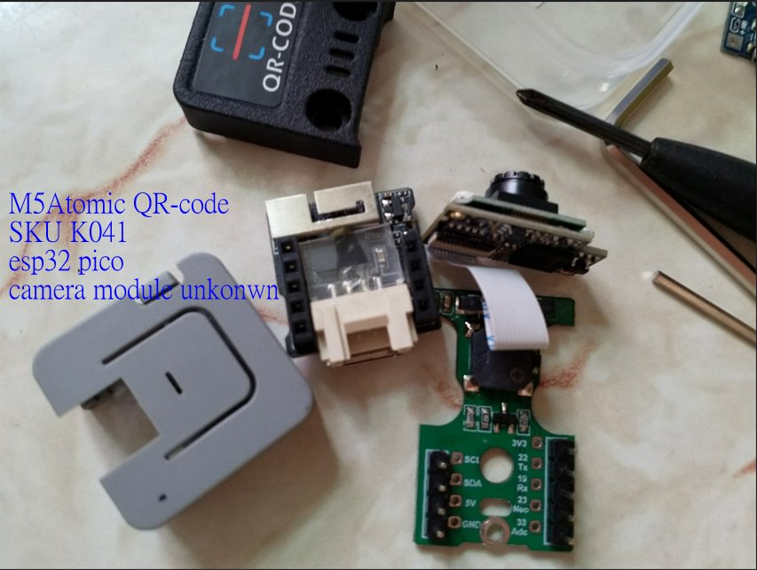
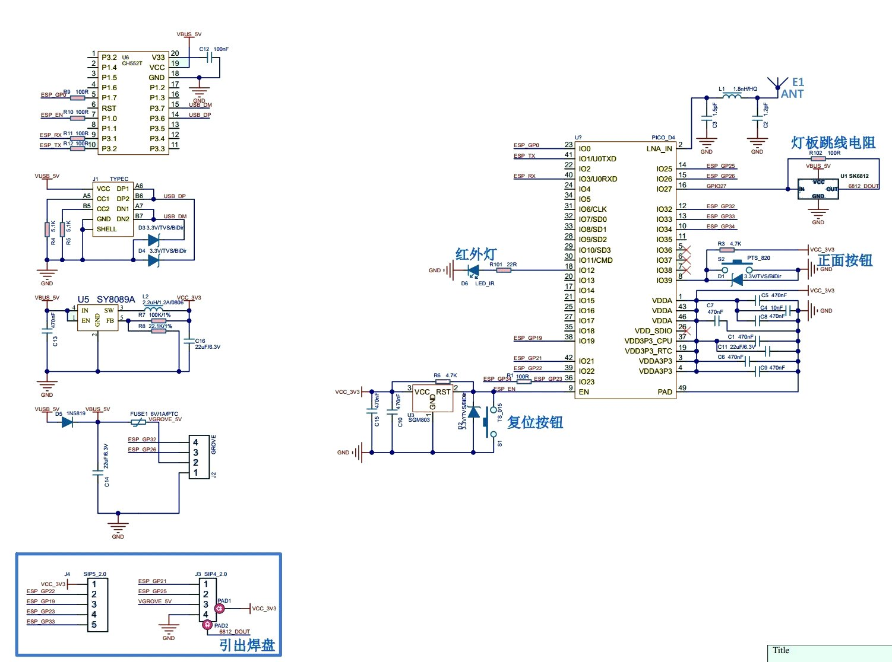

# ESP32 M5Stack ATOM lite QR-code
module and camera for barcode

the kit, SKU K041
https://docs.m5stack.com/en/atom/atomic_qr
burn stock firmware, 9600baud, EasyLoader_QRCODE_ATOM_BASE.exe
testing done, 115200 baud, [BTN_CONTROL](BTN_CONTROL)

  

  
